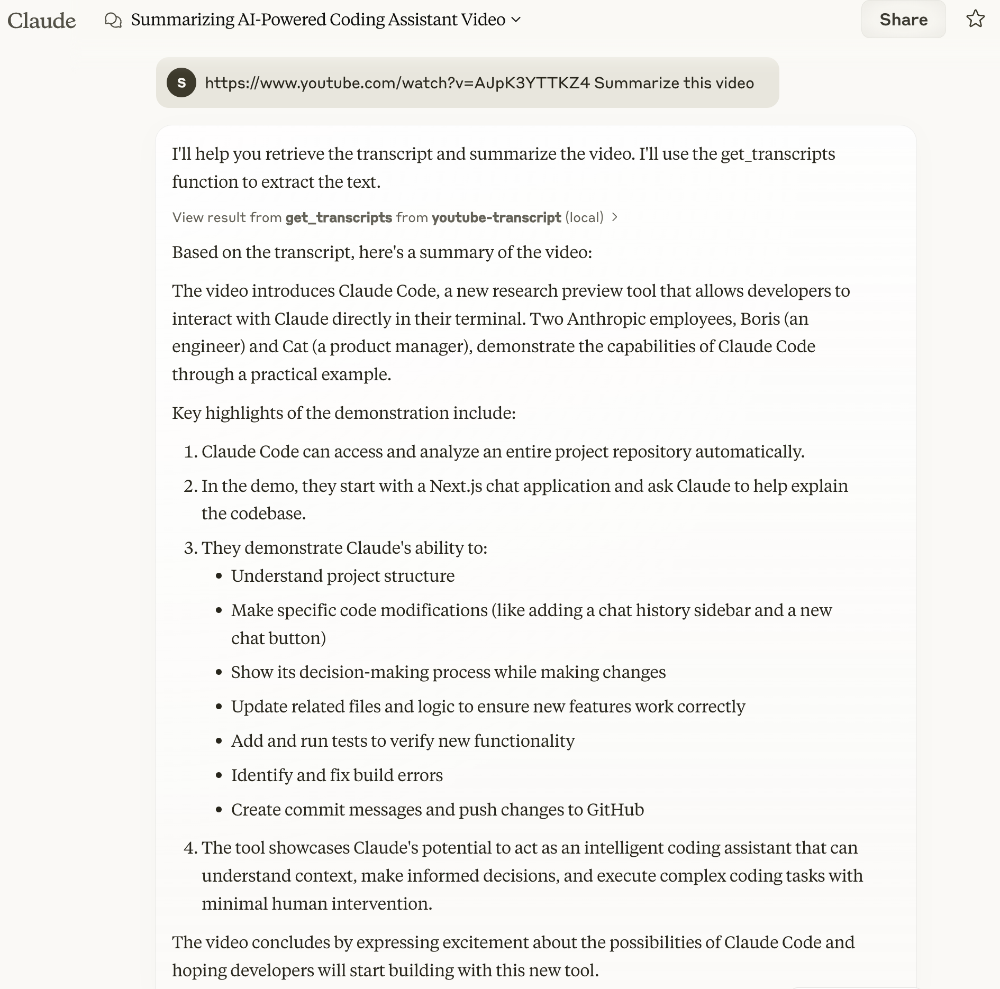

# MCP YouTube Transcript Server

A Model Context Protocol server that enables retrieval of transcripts from YouTube videos. This server provides direct access to video transcripts through a simple interface, making it ideal for content analysis and processing.


## Table of Contents
- [Features](#features)
- [Getting Started](#getting-started)
  - [Prerequisites](#prerequisites)
  - [Installation](#installation)
- [Usage](#usage)
  - [Basic Configuration](#basic-configuration)
  - [Testing](#testing)
  - [Troubleshooting and Maintenance](#troubleshooting-and-maintenance)
- [API Reference](#api-reference)
- [Development](#development)
- [Contributing](#contributing)
- [License](#license)

## Features

✨ Key capabilities:
- Extract transcripts from YouTube videos
- Support for multiple languages
- Format text with continuous or paragraph mode
- Retrieve video titles and metadata
- Automatic paragraph segmentation
- Text normalization and HTML entity decoding
- Robust error handling
- Timestamp and overlap detection

## Getting Started

### Prerequisites

- Node.js 18 or higher

### Installation

We provide two installation methods:

#### Option 1: Manual Configuration (Recommended for Production)

1. Create or edit the Claude Desktop configuration file:
   - macOS: `~/Library/Application Support/Claude/claude_desktop_config.json`
   - Windows: `%APPDATA%\Claude\claude_desktop_config.json`

2. Add the following configuration:

```json
{
  "mcpServers": {
    "youtube-transcript": {
      "command": "npx",
      "args": [
        "-y",
        "@gabriel3615/mcp-youtube-transcript"
      ]
    }
  }
}
```

Quick setup script for macOS:

```bash
# Create directory if it doesn't exist
mkdir -p ~/Library/Application\ Support/Claude

# Create or update config file
cat > ~/Library/Application\ Support/Claude/claude_desktop_config.json << 'EOL'
{
  "mcpServers": {
    "youtube-transcript": {
      "command": "npx",
      "args": [
        "-y",
        "@gabriel3615/mcp-youtube-transcript"
      ]
    }
  }
}
EOL

```
## Usage

### Basic Configuration

To use with Claude Desktop / Cursor / cline, ensure your configuration matches:

```json
{
  "mcpServers": {
    "youtube-transcript": {
      "command": "npx",
      "args": ["-y", "@gabriel3615/mcp-youtube-transcript"]
    }
  }
}
```

### Testing

#### With Claude App

1. Restart the Claude app after installation
2. Test with a simple command:
   ```plaintext
   https://www.youtube.com/watch?v=AJpK3YTTKZ4 Summarize this video
   ```

Example output:


#### With MCP Inspector

```bash
# Clone and setup
git clone https://github.com/flying3615/mcp-youtube-transcript.git
cd mcp-youtube-transcript
npm install
npm run build

# Launch inspector
npx @modelcontextprotocol/inspector node "dist/index.js"

# Access http://localhost:6274 and try these commands:
# 1. Paste the session id to pass authentication
# 2. List Tools: clink `List Tools`
# 3. Test get_transcripts with:
#    url: "https://www.youtube.com/watch?v=LCEmiRjPEtQ"
#    lang: "en" (optional)
#    enableParagraphs: false (optional)
```

### Troubleshooting and Maintenance

#### Checking Claude Logs

To monitor Claude's logs, you can use the following command:

```bash
tail -n 20 -f ~/Library/Logs/Claude/mcp*.log
```

This will display the last 20 lines of the log file and continue to show new entries as they are added.

> **Note**: Claude app automatically prefixes MCP server log files with `mcp-server-`. For example, our server's logs will be written to `mcp-server-youtube-transcript.log`.

#### Cleaning the `npx` Cache

If you encounter issues related to the `npx` cache, you can manually clean it using:

```bash
rm -rf ~/.npm/_npx
```

This will remove the cached packages and allow you to start fresh.

## API Reference

### get_transcripts

Fetches transcripts from YouTube videos.

**Parameters:**
- `url` (string, required): YouTube video URL or ID
- `lang` (string, optional): Language code (default: "en")
- `enableParagraphs` (boolean, optional): Enable paragraph mode (default: false)

**Response Format:**
```json
{
  "content": [{
    "type": "text",
    "text": "Video title and transcript content",
    "metadata": {
      "videoId": "video_id",
      "title": "video_title",
      "language": "transcript_language",
      "timestamp": "processing_time",
      "charCount": "character_count",
      "transcriptCount": "number_of_transcripts",
      "totalDuration": "total_duration",
      "paragraphsEnabled": "paragraph_mode_status"
    }
  }]
}
```

### download_video

Downloads a video from YouTube.

**Parameters:**
- `url` (string, required): YouTube video URL or ID
- `output` (string, optional): The path to save the video file (default: "video.mp4")

**Response Format:**
```json
{
  "content": [{
    "type": "text",
    "text": "Video successfully downloaded to video.mp4",
    "metadata": {
      "videoId": "video_id",
      "path": "video.mp4",
      "timestamp": "processing_time"
    }
  }]
}
```

## Development

### Project Structure

```
├── src/
│ ├── index.ts            # Server entry point
│ ├── index.ts          # YouTube transcript fetching logic
├── dist/                 # Compiled output
└── package.json
```

### Key Components

- `YouTubeTranscriptFetcher`: Core transcript fetching functionality
- `YouTubeUtils`: Text processing and utilities

### Features and Capabilities

- **Error Handling:**
  - Invalid URLs/IDs
  - Unavailable transcripts
  - Language availability
  - Network errors
  - Rate limiting

- **Text Processing:**
  - HTML entity decoding
  - Punctuation normalization
  - Space normalization
  - Smart paragraph detection

## Contributing

We welcome contributions! Please feel free to submit issues and pull requests.

## License

This project is licensed under the MIT License - see the [LICENSE](LICENSE) file for details.

## Related Projects

- [mcp-servers](https://github.com/modelcontextprotocol/servers)
- [MCP Inspector](https://github.com/modelcontextprotocol/inspector)
